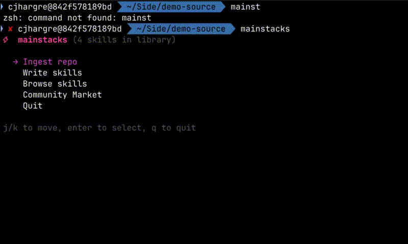
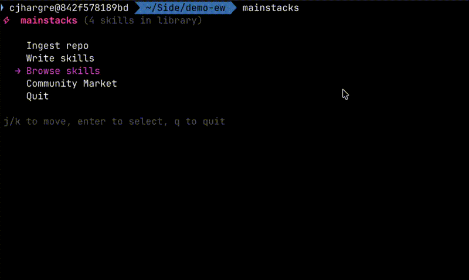
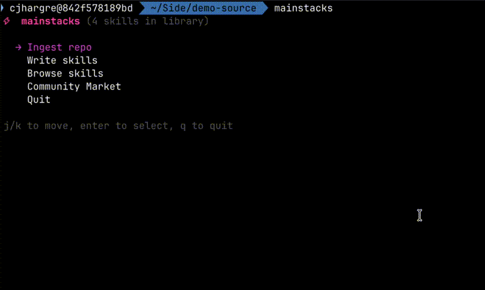
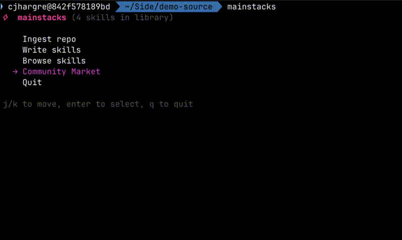

# mainstacks

Build a library of reusable skills from code you've already written. Feed them to coding agents to ship faster.

Like a producer reusing loops they've made before, mainstacks lets you extract patterns from past projects and drop them into new ones. Your agents get context on how you build things, so they stop guessing and start building the way you would.

## Install

```bash
brew tap cjhargreaves/tap
brew install mainstacks
```

Or build from source:

```bash
git clone https://github.com/cjhargreaves/mainstacks.git
cd mainstacks
go build ./cmd/mainstacks
cp mainstacks ~/.local/bin/
```

## Quick start

```bash
cd ~/my-project
mainstacks
```

First run will ask for a [Google AI API key](https://aistudio.google.com/apikey) (free tier works).

## Usage

### TUI

Run `mainstacks` in any directory:

```
⚡ mainstacks (5 skills in library)

→ Ingest repo
  Write skills
  Browse skills
  Community Market
  Quit
```

- **Ingest repo** — scans a directory, extracts skills into your library



- **Write skills** — select skills and write a `SKILLS.md` to the current directory



- **Browse skills** — view, inspect, and delete skills from your library



- **Community Market** — browse, search, download, and upload skills shared by others



### Community Market

Share skills with other developers and discover new ones:

```
⚡ mainstacks → Community Market

→ Browse & download skills
  Search skills
  Upload a skill
  Back
```

- **Browse & download** — see all community skills, press `d` to add one to your library
- **Search** — filter community skills by name, tags, or description
- **Upload** — publish a skill from your library (requires `GITHUB_TOKEN`)

Browsing and downloading works with no setup. To publish skills, set `GITHUB_TOKEN` in your environment.

### CLI

```bash
# Ingest current directory
mainstacks ingest .

# Ingest a specific path
mainstacks ingest ~/projects/my-api

# Ask a question against your skill library
mainstacks query "how do I implement stride-based indexing?"

# Browse community skills
mainstacks community

# Publish a skill to the community
mainstacks publish "gRPC Auth Interceptor"
```

## What's a skill?

A skill is a pattern extracted from your code that you or an agent can reuse:

```
┌─────────────────────────────────────────────────────┐
│ Name:    gRPC Auth Interceptor                      │
│ Type:    code                                       │
│ Source:  auth.go, middleware.go                     │
│ Tags:    grpc, auth, middleware                     │
│ Deps:    google.golang.org/grpc                     │
│                                                     │
│ Summary: Server-side unary interceptor that         │
│   validates JWT tokens and injects claims           │
│   into the context.                                 │
│                                                     │
│ Pattern:                                            │
│   func AuthInterceptor(ctx context.Context,         │
│     req interface{}, info *grpc.UnaryServerInfo,    │
│     handler grpc.UnaryHandler) (interface{}, error) │
│                                                     │
│ Usage: Add to grpc.NewServer() chain with           │
│   grpc.UnaryInterceptor(AuthInterceptor)            │
└─────────────────────────────────────────────────────┘
```

Skills are grouped by category:

- **Patterns** — reusable code patterns, algorithms, implementations
- **Infrastructure** — deployment, CI/CD, cloud configs
- **Operations** — runbooks, procedures, checklists
- **Design** — architecture decisions, system designs

## How it works

```
cd any-repo && mainstacks ingest .
         ↓
  Reads all text files (skips binaries, node_modules, etc.)
         ↓
  Analyzes the entire codebase at once
         ↓
  Extracts distinct, transferable skills (not one per file)
         ↓
  Stores in ~/.mainstacks/skills.db
         ↓
  Write selected skills to SKILLS.md in any project
```

## Community Hub

The community marketplace is backed by [mainstacks-hub](https://github.com/cjhargreaves/mainstacks-hub). Skills are stored as JSON files in the `skills/` directory. No account needed to browse — it's a public repo.

## Config

Your API key and settings live at `~/.mainstacks/config`. The skill database lives at `~/.mainstacks/skills.db`. Everything is local.

## License

MIT
